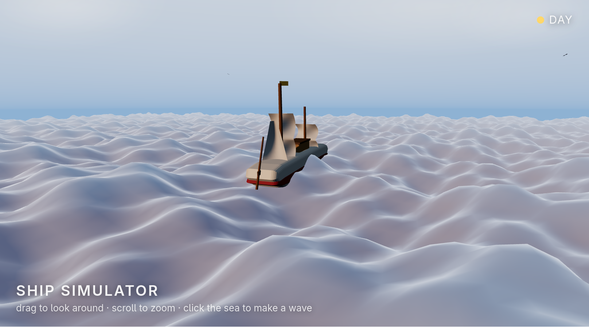
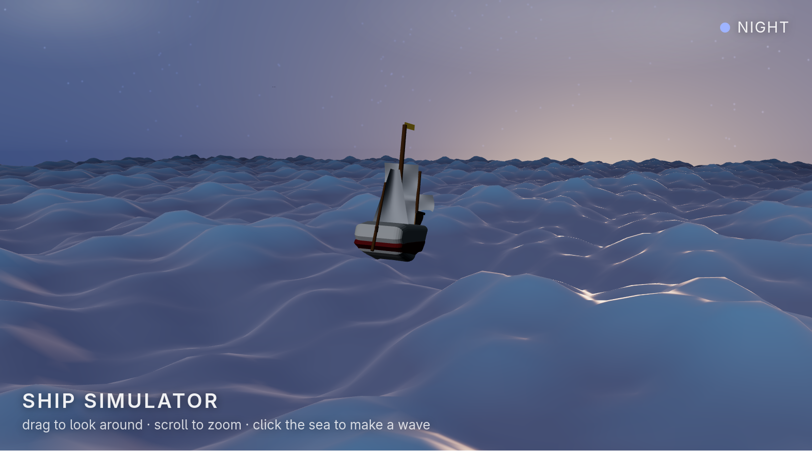
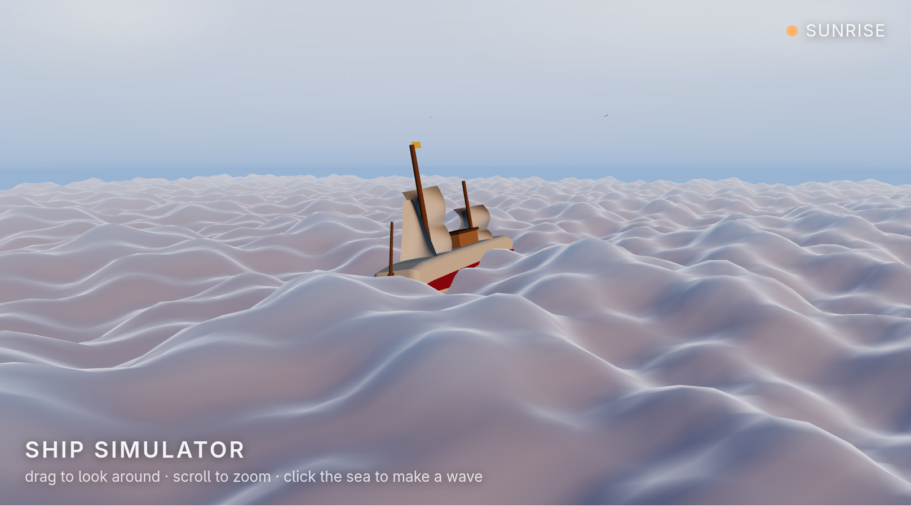
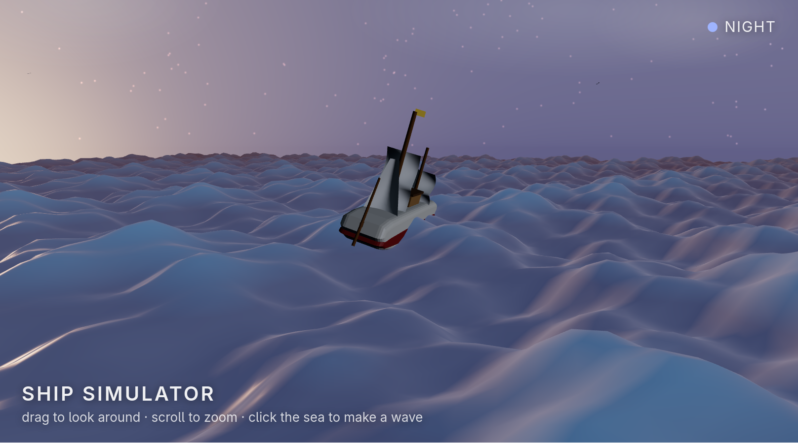

# Ship Simulator

A beautiful, relaxing 3D ship simulator for the browser.

| Day | Night |
| --- | --- |
|  |  |
| **Sunrise** | **Sunset** |
|  |  |

## Features

- **3D sailing ship** built from primitives: curved extruded hull, deck, cabin, two masts, billowed sails, bowsprit jib, and a waving flag.
- **Day and night cycle**: the sun rises and dips below the horizon while the sky, fog, stars, moonlight and lighting transition through sunrise, day, sunset and night.
- **Click the sea to make waves**: clicking anywhere on the open water spawns a spreading ripple ring that rolls across the swells.
- **Live ocean**: a custom GLSL shader drives gentle multi-directional swells with fresnel reflections and sun/moon sparkle. The ship pitches, rolls and rides the swell.
- **Ambience**: drifting clouds, circling seabirds, a moon with stars, warm sunset bands, and a slowly auto-orbiting camera (drag to look, scroll to zoom).
- A small HUD reports the current phase (SUNRISE / DAY / SUNSET / NIGHT).

Everything is generated procedurally: no textures, no external assets, and the runtime is bundled into a single script that needs **no network connection**.

## Run

Two options, both offline:

- **Double-click** `index.html` in any modern browser (works from `file://`).
- Or serve it over HTTP:

  ```bash
  python3 -m http.server 8080
  # then visit http://localhost:8080/index.html
  ```

The page needs only WebGL. If WebGL is unavailable or disabled, a friendly notice is shown instead.

## Building

The shipped `dist/ship-sim.js` already contains Three.js r160 and the app. To rebuild it:

```bash
bun install      # resolves the vendored three package (no network needed)
bun run build    # outputs dist/ship-sim.js
```

- `src/app.mjs` is the application source.
- `node_modules/three/` vendors Three.js r160 (module build + OrbitControls) so builds are reproducible offline.
- The bundle is minified, self-contained, and loaded by `index.html` as a plain classic script (no import map, no CDN).

## How it works

- `DAY_PERIOD` (110 s) controls the full day-night cycle: change it for a faster or slower sun.
- The motor wave set in `WAVES` balances long rolling swells with smaller local chop. The vertex shader uses the same terms so the ship's bobbing matches the visible water.
- Splashes are CPU-side splash records streamed into the shader as uniform arrays (max `MAX_SPLASH` = 16 simultaneous rings). Dragging the camera never creates a splash; only clean clicks on open water do.
- All colors for sky, fog and lighting are interpolated from the sun's elevation each frame; ACES tone mapping keeps highlights soft.

## Tech

- [Three.js r160](https://threejs.org)
- Custom `ShaderMaterial` for ocean + sky dome, `MeshStandardMaterial` for the ship
- OrbitControls for the camera
- Bundled with [Bun](https://bun.sh)

## Files

- `index.html` - page markup, styles, and the WebGL-unavailable fallback
- `src/app.mjs` - the entire application source (simulation, shaders, ship model)
- `dist/ship-sim.js` - the bundled, minified, self-contained build loaded by `index.html`
- `node_modules/three/` - vendored Three.js r160 + OrbitControls source
- `docs/` - screenshots of each phase